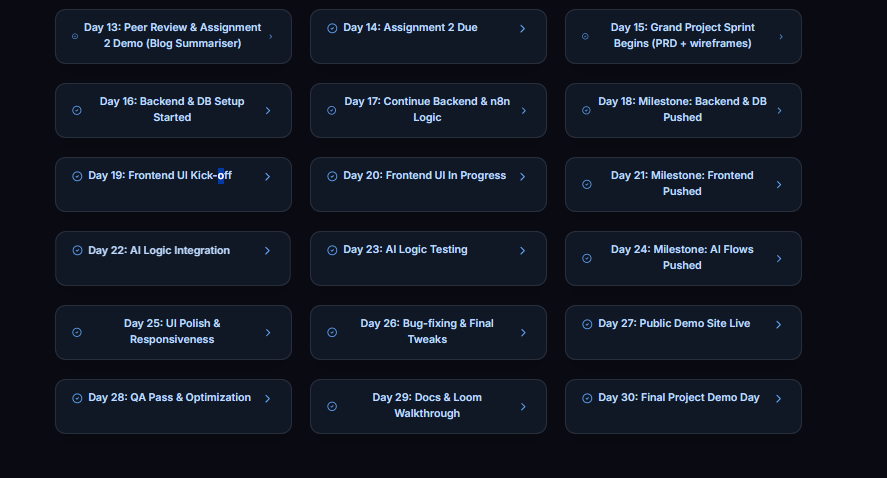

# Resume Tailor - Product Requirements Document

## Overview
**Resume Tailor** is an AI-powered web application that helps job seekers customize their resumes for specific job descriptions, improving their chances of passing Applicant Tracking Systems (ATS) and getting interviews.

## Key Features
1. **Magic Link Authentication**
   - Secure login via email magic links using Supabase Auth
   - Session management

2. **Resume Management**
   - PDF/DOCX file upload and parsing
   - Resume storage in MongoDB
   - Version history

3. **Job Description Analysis**
   - Text input for job descriptions
   - Keyword extraction
   - Skill requirement identification

4. **AI-Powered Tailoring**
   - n8n workflows calling OpenAI API
   - Comparison between resume and job description
   - Customized suggestions for improvements

5. **Export Options**
   - Download tailored resume in multiple formats
   - ATS compatibility scoring

## Technical Specifications

### Frontend
- Next.js 15 (App Router)
- TypeScript
- Tailwind CSS + shadcn/ui components
- File upload handling

### Backend
- Next.js API routes
- Supabase for authentication
- MongoDB for resume storage
- Prisma ORM

### AI Integration
- n8n workflows for:
  - Text analysis
  - Comparison algorithms
  - Suggestion generation

### Infrastructure
- Vercel hosting
- Supabase Postgres (auth)
- MongoDB Atlas (data)

## User Flow
1. User signs in via magic link
2. Uploads existing resume
3. Inputs target job description
4. Receives AI-powered analysis:
   - Missing keywords
   - Skill gaps
   - Suggested rewrites
5. Edits resume with guidance
6. Downloads tailored version

## Milestones & Timeline
